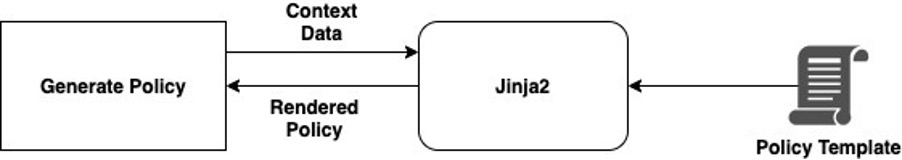

**Managing and rendering AWS policies and IaC templates with Jinja2 and Python**

[SaaS](https://en.wikipedia.org/wiki/Software_as_a_service) platforms cater to multiple tenants through separate and specific [AWS policies](https://docs.aws.amazon.com/robomaker/latest/dg/auth_access_what-are-policies.html) , [IAM roles](https://docs.aws.amazon.com/IAM/latest/UserGuide/id_roles.html) as per their end user's need. Infrastructure-as-code being a common part of cloud infrastructure, various [IaC](https://en.wikipedia.org/wiki/Infrastructure_as_code)(infrastructure As Code) tools such as [AWS CloudFormation](https://aws.amazon.com/cloudformation/)(CF) template or a third party tool like [Terraform](https://www.terraform.io/),  are used to provision cloud infrastructure. 

These templates or policies mostly contains declarative, repetitive and changing methods of defining a set of AWS infrastructure or permissions. All of these resource based policies or templates may require frequent , repetitive and dynamic changes. 

You may get some of real time situations such as, 

- Creation or updating resources dynamically through code based on conditions
- Maintaining dynamic isolation specific to account vs resources/permissions.
- Generate run time template parameter values based on any input file , command line or configuration.

**Examples**:

- Changing parameters of a [AWS Lamda ](https://aws.amazon.com/lambda/)function mentioned in [AWS Cloud Formation Stack](https://docs.aws.amazon.com/AWSCloudFormation/latest/UserGuide/aws-properties-stack.html) to provision a set of AWS infrastructure on fly.
- Separate AWS S3 bucket policy for to isolate users and user’s privileges on the fly.
- ABAC based policy control
- RBAC based policy control

Quick syntactical examples could be,

**Example 1**: **{{user}}** can access bucket **{{bucket\_name}}**

- If user==**John** he can access S3 bucket “**Admin**”
- If user==**Harry** he can access S3 bucket “**Developer**”

**Example 2**: **{{user1}}**users can read **{{bucket\_name1}}** S3 buckets but users from the **{{department}}**department can only **{{operation1}}** from **{{bucket\_name2}}** bucket and **{{user2}}** can **{{ operation2}}** all objects in **{{ bucket\_name1}}** S3 bucket except **{{ bucket\_name2}}** bucket objects.

**All** users can read **staging** S3 buckets but users from the **Sales** department can only **read** from **staging** CRM bucket and **admin** can **delete** all objects in **staging** S3 bucket except **CRM** bucket objects.

These syntaxes can change over the period of time depending on functionality need.To handle these types of random changes , IaC templates needs customised changes for each of the requirements. These can be managed from application code with the help of Jinja2 template engine to generate dynamic policies based on user’s role.

Jinja2 is a powerful and widely used template engine for Python that allows developers to generate dynamic content from your application code.

Here the examples code is based on AWS IAM policy. Similar approach can be taken to support any other IaC template rendering irrespective of cloud provider.

**Architecture**

**Prerequisites**

The following packages should be installed and configured prior to deploying this pattern:

1. [Python version 3.7](https://docs.python.org/3/using/index.html) or later
2. [AWS CL](https://aws.amazon.com/cli/)I
3. [Jinja2](https://pypi.org/project/Jinja2/) template engine
4. [boto3](https://boto3.amazonaws.com/v1/documentation/api/latest/guide/quickstart.html) library (Optional)
5. [IAM User with create policy permission](https://docs.aws.amazon.com/IAM/latest/UserGuide/id_users_create.html#id_users_create_console). (Optional)

**Installation and execution steps**

1. Python and other packages
- Install [Python 3.7 or later](https://docs.python.org/3/using/index.html)
- Install [Jinja2](https://pypi.org/project/Jinja2/) template engine
- Install AWS SDK for Python - [boto3](https://pypi.org/project/boto3/) (Optional)
2. Configure AWS CLI (Optional)
- Install AWS CLI
- Configure access key and secret key using **aws configure** command
3. Setup Python script and Jinja template
- Change policy.j2  and role.j2 contents as required
4. Execute the python script
- Run Example  Python Script - *python handle\policy.py* to generate IAM policy
5. Please check in AWS console if the policy are created as per the template and input provided in templates (Optional)

**Issues**

Feel free to create a new issue in cause of any trouble will be happy to resolve.

**Contributing**

Pull requests are welcome.

**Conclusion**

This is a sample code example which illustrates how to use application code to render dynamic IaC templates.You can implement your own logic depending on specific need.
